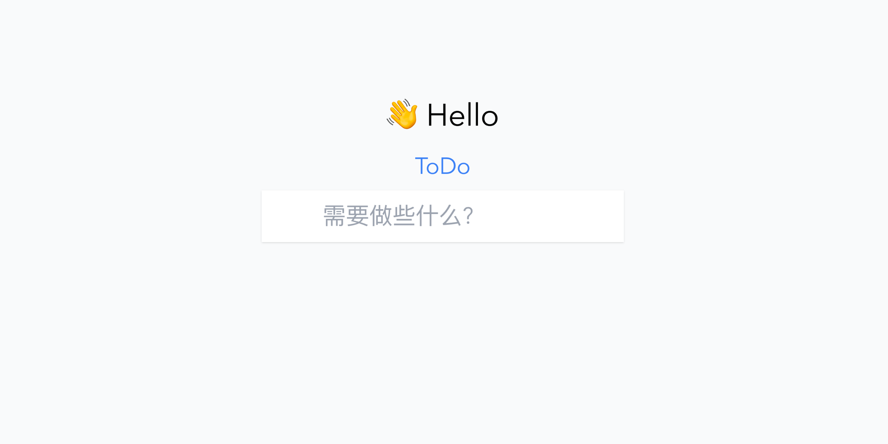

## 这是一个基于最新的技术架构开发的 ToDo App

### 特性

 - 🔧 Vue3，Vite2 - 前端最新技术；

 - ⚙️ TypeScript - 应用程序级 JavaScript 的语言；

 - 📦 pnpm - 快速、节省磁盘空间的包管理器；

 - 👔 TailwindCSS - 原子 CSS 引擎；

### 初心

- 深入学习 Vue3 + Vite + TS；
- 学习并掌握项目开发规范、代码规范等；
- 学习并掌握维护开源项目流程，为日后参加开源打好基础；
- 抱团进步，一起学习，共同维护，相互 review，步步高升；

### 感谢朋友们的帮助

### LICENSE

MIT, Copyright (c) 2022 wang01h2.
